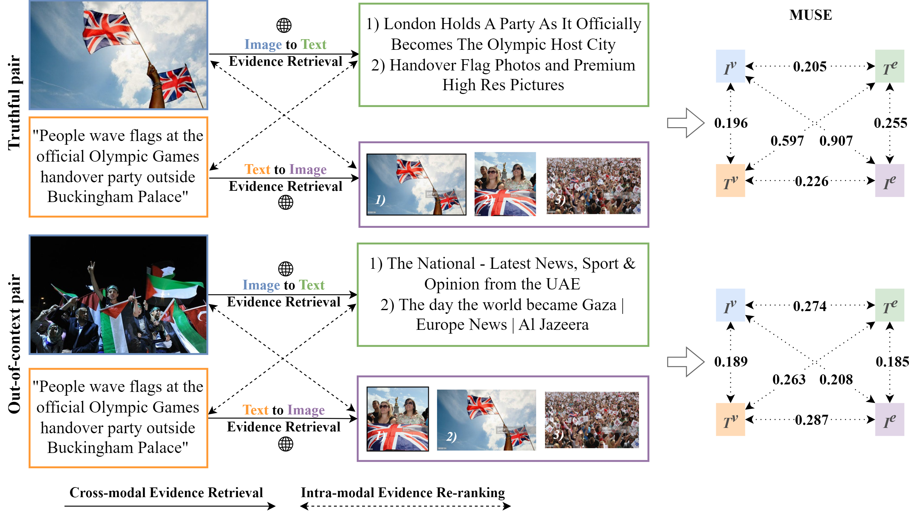

# Similarity over Factuality: Are we making progress on multimodal out-of-context misinformation detection?
Repository for the "Similarity over Factuality: Are we making progress on multimodal out-of-context misinformation detection?" paper

## Abstract
>*Out-of-context (OOC) misinformation poses a significant challenge in multimodal fact-checking, where images are paired with texts that misrepresent their original context to support false narratives. Recent research in evidence-based OOC detection has seen a trend towards increasingly complex architectures, incorporating Transformers, foundation models, and large language models. In this study, we introduce a simple yet robust baseline, which assesses MUltimodal SimilaritiEs (MUSE), specifically the similarity between image-text pairs and external image and text evidence. Our results demonstrate that MUSE, when used with conventional classifiers like Decision Tree, Random Forest, and Multilayer Perceptron, can compete with and even surpass the state-of-the-art on the NewsCLIPpings and VERITE datasets. Furthermore, integrating MUSE in our proposed "Attentive Intermediate Transformer Representations" (AITR) significantly improved performance, by 3.3% and 7.5% on NewsCLIPpings and VERITE, respectively. Nevertheless, the success of MUSE, relying on surface-level patterns and shortcuts, without examining factuality and logical inconsistencies, raises critical questions about how we define the task, construct datasets, collect external evidence and overall, how we assess progress in the field.*



## Preparation
- Clone this repo: 
```
git clone https://github.com/stevejpapad/outcontext-misinfo-progress
cd outcontext-misinfo-progress
```
- Create a python (>= 3.9) environment (Anaconda is recommended) 
- Install all dependencies with: `pip install -r requirements.txt`.

## Datasets
If you want to reproduce the experiments of the paper, it is necessary to first download the following datasets and save them in their respective folder: 
- VisualNews -> https://github.com/FuxiaoLiu/VisualNews-Repository -> `VisualNews/`
- NewsCLIPings -> https://github.com/g-luo/news_clippings -> `news_clippings/`
- NewsCLIPings evidence -> https://github.com/S-Abdelnabi/OoC-multi-modal-fc -> `news_clippings/queries_dataset/`
- VERITE and VERITE evidence -> https://github.com/stevejpapad/image-text-verification -> `VERITE/` 

If you encounter any problems while downloading and preparing VERITE (e.g., broken image URLs), please contact stefpapad@iti.gr

## Reproducibility
To prepare the datasets, extract CLIP features and reproduce all experiments run: 
```python src/main.py``` 

## Citation
If you find our work useful, cite:
```
@article{papadopoulos2024similarity,
  title={Similarity over Factuality: Are we making progress on multimodal out-of-context misinformation detection?},
  author={Papadopoulos, Stefanos-Iordanis and Koutlis, Christos and Papadopoulos, Symeon and Petrantonakis, Panagiotis C},
  journal={arXiv preprint arXiv:2407.13488},
  year={2024}
}
```

## Acknowledgements
This work is partially funded by the project "vera.ai: VERification Assisted by Artificial Intelligence" under grant agreement no. 101070093.

## Licence
This project is licensed under the Apache License 2.0 - see the [LICENSE]([https://github.com/stevejpapad/relevant-evidence-detection/blob/main/LICENSE](https://github.com/stevejpapad/outcontext-misinfo-progress/blob/main/LICENSE)) file for more details.

## Contact
Stefanos-Iordanis Papadopoulos (stefpapad@iti.gr)
